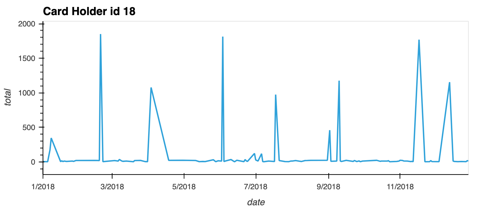
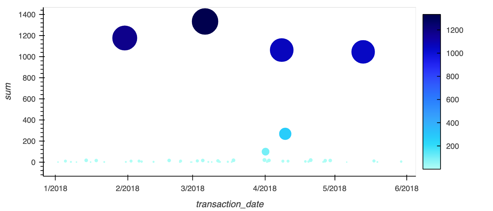

# Homework Assignment 7: Looking for Suspicious Transactions

## Background

Fraud is prevalent these days, whether you are a small taco shop or a large international business. While there are emerging technologies that employ machine learning and artificial intelligence to detect fraud, many instances of fraud detection still require strong data analytics to find abnormal charges.

In this homework assignment, I have applied my new SQL skills to analyze historical credit card transactions and consumption patterns in order to identify possible fraudulent transactions.

### Part I

I have accomplished three main tasks:

1. 
    

    
Data Modeling

    I have created an entity relationship diagram (ERD) by inspecting the provided CSV files.

    
    

---
2. 
    

    
 Data Engineering

    Part of the challenge here was to figure out how many tables I should create, as well as what kind of relationships I need to define among the tables. After creating a database schema on SQL and populated my database/tables from the CSV files provided, based on the ERD Diagram I have set up primary keys and foreign keys:
    * card_holder table has: PK card_holder_id.
    * credit_card table has: PK card_number and FK card_holder_id used as a reference to link with card_holder table.
    * transaction table has: PK transaction_id and 2-FK card_number used as a reference to link with credit_card table and merchant_id used as a reference to link with merchant table. NOTICE this is the only table that has many to many relationships, playing the role of a bridge to link data.
    * merchant table has: PK merchant_id and PF merchant_category_id used as a reference to link with merchant_category table.
    * merchant_category table has: PK merchant_category_id

    

---
3. 
    

    
 Data Analysis 

    Analyzed data and identified possible fraudulent transactions, for more detailed information look under the Query Files below.
        
        Grouped/isolated the transactions of each cardholder, using the query below:

            SELECT full_name, COUNT(transaction_id) AS number_of_transaction_per_cardholder
	        FROM "transaction" t
            INNER JOIN credit_card c
	            ON c.card_number = t.card_number
            INNER JOIN card_holder h
	            ON h.card_holder_id = c.card_holder_id
            GROUP BY full_name
	        ORDER BY number_of_transaction_per_cardholder DESC;

        Counted the transactions that are less than $2.00 per cardholder, using the query below:

            SELECT h.full_name, COUNT(*) AS transactions_smaller_than_$2
	        FROM transaction t 
            INNER JOIN credit_card c
	            ON c.card_number = t.card_number
            INNER JOIN "card_holder" h 
	            ON c.card_holder_id = h.card_holder_id
            WHERE amount < 2
	        GROUP BY h.card_holder_id, h.full_name
	        ORDER BY transactions_smaller_than_$2 DESC;

    I think that the evidence that some credit cards have been hacked are the fact that one card holder has 26 transactions over the course of a year that are less than 2.00 USD. I believe that any card holder with more than fifteen less than 2$-transactions per year can be considered as a sign of their credit card being hacked.

        Took my investigation a step further by considering the time period in which potentially fraudulent transactions are made.

            SELECT *	
            FROM transaction AS early_transactions
	        WHERE date_part('hour', transaction_date ) BETWEEN 7 AND 9
            ORDER BY amount DESC
            LIMIT 100;
        
        If there is a higher number of fraudulent transactions made during this time frame versus the rest of the day I used these queries:

            SELECT COUNT(*)	
            FROM transaction AS number_of_transactions_7to9
	        WHERE date_part('hour', transaction_date ) BETWEEN 7 AND 9;

        First result stated that were 419 transactions from 7 to 9 am

            SELECT COUNT(*)	
            FROM transaction AS number_of_transactions_after9
	        WHERE date_part('hour', transaction_date ) NOT BETWEEN 7 AND 9
            ;
        Second result stated that were 3081 transactions after 9 am

        Checking if the merchants also have been hacked by hackers with these small transactions, this query helped me figuring that out:

            SELECT merchant_name, COUNT(t.transaction_id) AS suspicious_trans
            FROM transaction t
            INNER JOIN merchant m
                ON t.merchant_id = m.merchant_id
            WHERE t.amount <2.00          
            GROUP BY merchant_name
            ORDER BY suspicious_trans DESC
            LIMIT 5;

        These results show that more than 10 different merchants have more than 5 transaction per year smaller than 2 USD.

        Top 5 Merchants prone to being hacked:
    

    

---
#### *DATA* 

 Query Files 

[Schema](Data/Schemas.sql)

[Queries](Data/Queries.sql)

[Seed](Data/all_tables_seed.sql)

 CSV Files 

[card_holder.csv](Data/card_holder.csv)

[credit_card.csv](Data/credit_card.csv)

[merchant.csv](Data/merchant.csv)

[merchant_category.csv](Data/merchant_category.csv)

[transaction.csv](Data/transaction.csv)

---
### Part II 

[Visual Data Analysis](Starter_Files/visual_data_analysis.ipynb)

During this part of the assignment we are supposing that my CFO has requested detailed trends data on specific card holders. 
I have used the starter notebook to query my database and generate visualizations that supply the requested information. 
As a next step the visualizations and observations are shown below in this report:

    

 Data Analysis Question 1 

    

The two most important customers of the firm may have been hacked. Verify if there are any fraudulent transactions in their history. For privacy reasons, you only know that their cardholder IDs are 2 and 18.

* Using hvPlot, I have created a line plot representing the time series of transactions over the course of the year for each cardholder separately.

* Next, to better compare their patterns, I have created a single line plot that contains both card holders' trend data.  

* It is clear that the card holder with the id 18 spends a lot more than card holder with id 2. It is a a huge difference that rises a red flag that a fraudulent transaction might have occur.

If we look at the results of the plot of the transactions between 7 and 9 am we can detect that a lot of transactions are made from bars and restaurants which is odd and suspicious, especially for large amounts. In this plot I have tried to demonstrate the value of the amount by the size of the dots.

 Data Analysis Question 2 

The CEO of the biggest customer of the firm suspects that someone has used her corporate credit card without authorization in the first quarter of 2018 to pay quite expensive restaurant bills. Again, for privacy reasons, you know only that the cardholder ID in question is 25.

* Using HvPlot, I have created a line, representing the expenditure data from January 2018 to June 2018 for cardholder ID 25.

* Are there any outliers for cardholder ID 25? How many outliers are there per month?

Using 2 standard deviation I was able to detect 4 outliers: [1177.0, 1063.0, 1046.0, 1334.0], which can easily be detected in this scatter plot of all transaction of card holder with id 25.

---

### Part III

[Visual Data Analysis *CHALLENGE*](Starter_Files/challenge.ipynb)

 Challenge 

Another approach to identifying fraudulent transactions is to look for outliers in the data. Standard deviation or quartiles are often used to detect outliers.

Using the information provided to have created  the code for two Python functions:
* One that uses standard deviation to identify anomalies for any cardholder.

    

    
    
>We can see here that is not a transaction for Elisabeth Sawyer between 07 and 09 am,  that's why it is not appearing on the second plot.

* Another that uses interquartile range to identify anomalies for any cardholder.

    

    
    

